# 📚 Ban9din Bookstore Project

## 📖 Introduction
A bookstore web application that allows users to browse and purchase books while providing admin functionality for managing products and orders.

## 🌍 Features
### Client (User Side)
- 🔑 **Authentication**: Login & Signup
- 🏠 **Home Page**: Browse books
- 📄 **Product Detail**: View book details
- 🛍 **Cart**: Add, remove, and update items in cart
- 📦 **Order**: Place and track orders
- 📱 **Responsive Design**: Optimized for mobile, tablet, and desktop

### Admin (Management Side)
- 🏠 **Dashboard**: Overview of store operations
- 📦 **CRUD Operations**:
  - ➕ **Add Product**
  - 📖 **Read Product**
  - ✏ **Update Product**
  - ❌ **Delete Product**
- 📦 **Order Management**: View and process orders
- 📄 **Pagination**: Efficient data handling for large product lists
- 📱 **Responsive Design**: Adaptive UI for different screen sizes

## 🛠 Tech Stack
- **Frontend**: React.js
- **Backend**: Node.js, Express.js
- **Database**: MongoDB
- **Authentication**: JWT
- **Styling**: Tailwind CSS

## 🌐 Live Demo & Swagger
- 🚀 **Live Demo (Netlify)**: [Bookstore Live Demo](https://ban9din-bookstore.netlify.app/)
- 🚀 **Live Demo (Render)**: [Bookstore_Admin Live Demo](https://ban9din-admin.netlify.app/)
- 🚨 **Note**: The live demo may experience some delays due to the current server performance. I appreciate your understanding.
## 🐱‍👤 User for test
```bash
Admin
root@email.com
root

User
user@email.com
user
```

### 📌 Swagger
```bash
https://quiz-server-9may.onrender.com/api-docs/
```
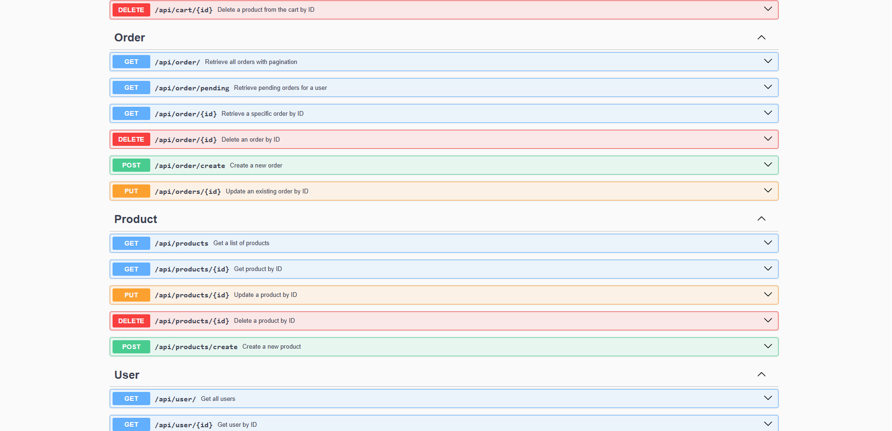

## 🖼 Screenshots Client & Admin Dashboard

### 📌 SignUp Page
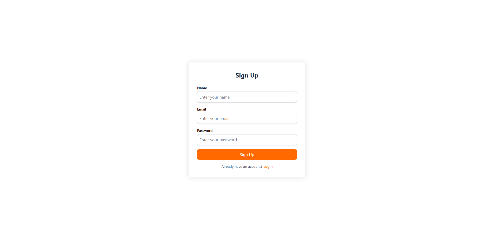

### 📌 Login Page
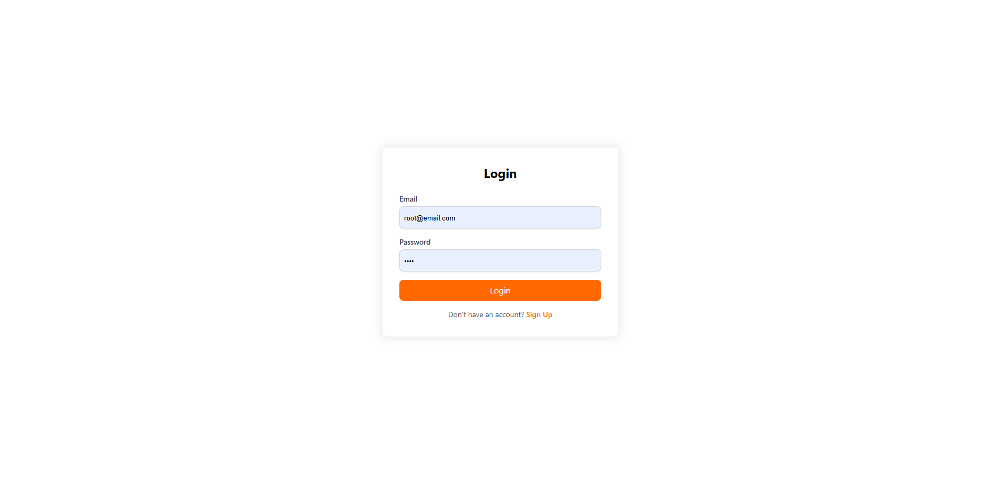

### 📌 Home Page
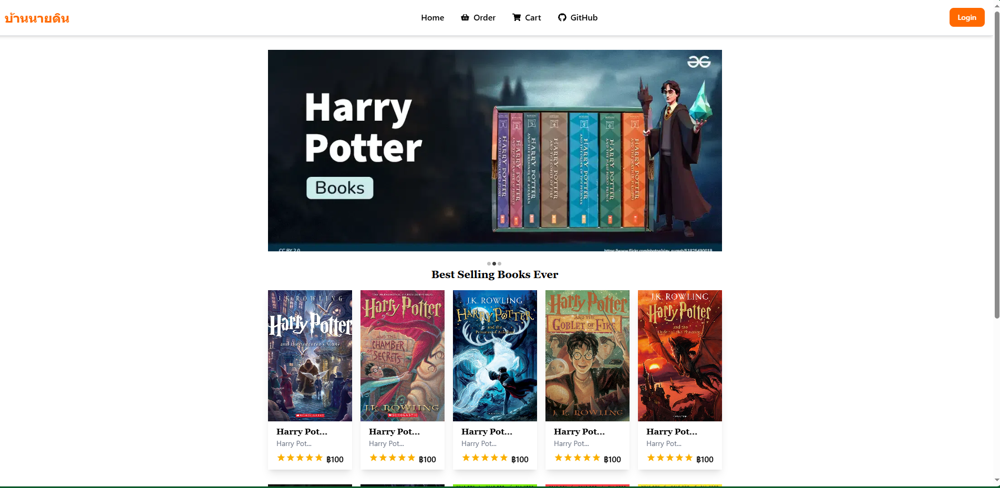

### 📌 Product Detail
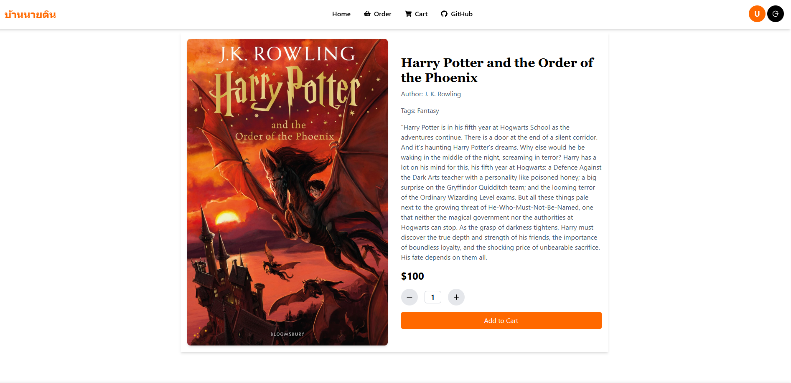

### 📌 Order Page
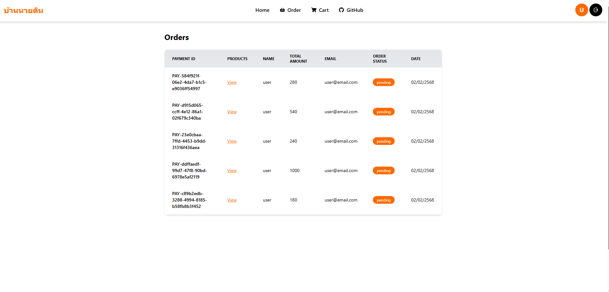

### 📌 Cart Page
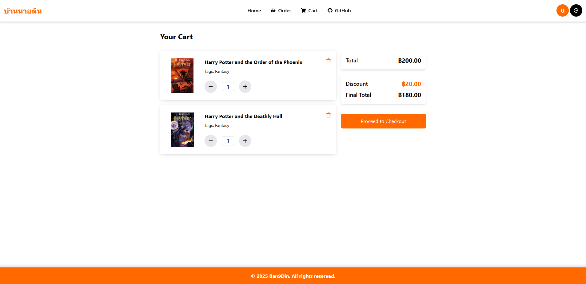

### 📌 Admin-Home Page
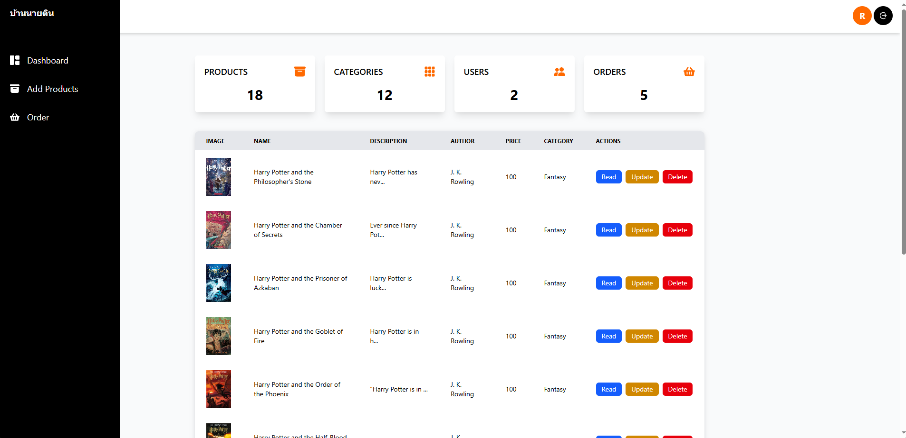

### 📌 Admin-Add Product Page
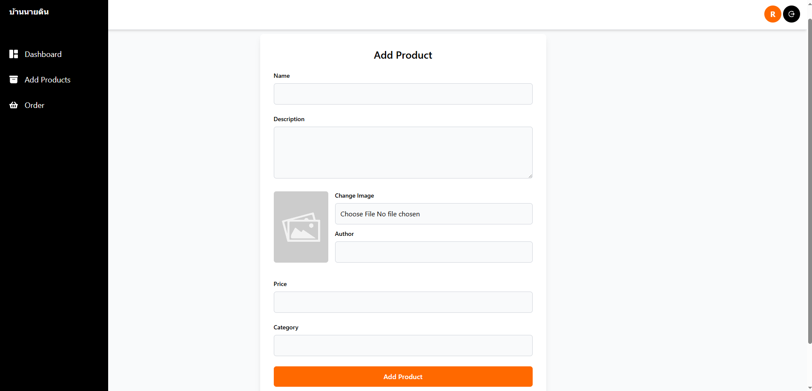

### 📌 Admin-Order Page
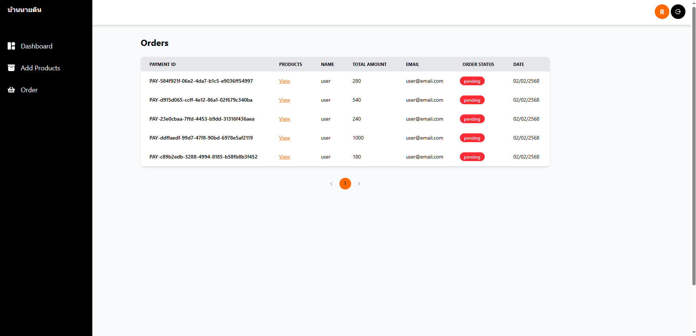

### 📌 Pagination
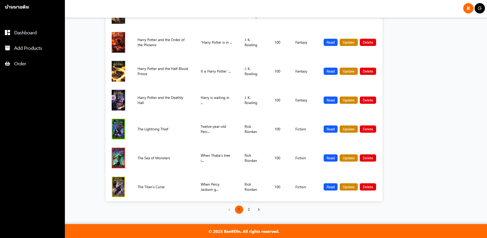

### 📌 Responsive
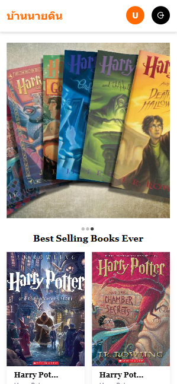

## 📝 Environment Variables

For the server 

```bash
# Port the server will listen on
PORT = your port

# MongoDB connection string
CONNECTION_STRING = "your-mongodb-connection-string-here"

# Secret key for JWT (JSON Web Token) authentication
JSON_WEB_TOKEN_SECRET_KEY = "your-jwt-secret-key-here"
```

For Client & Admin
```bash
VITE_API_URL = https://quiz-server-9may.onrender.com or Replace with your API UR
```
